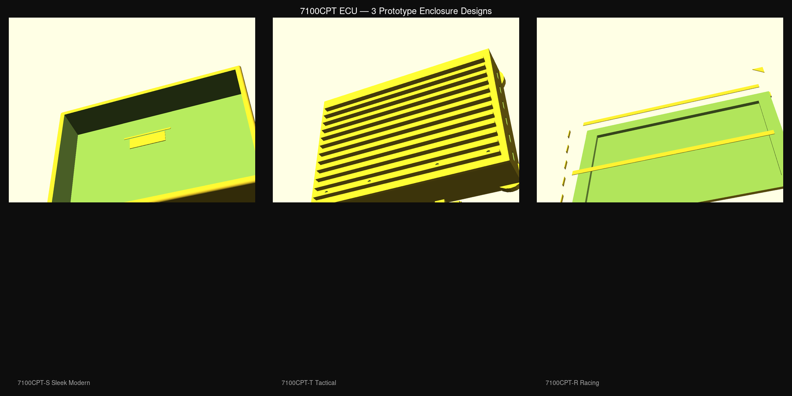

# 7100CPT ECU — PCB & Enclosure Designs

> **Date:** 2026-07-05
> **Author:** 7100CPT Engineering

---

## Enclosure Designs — 3 Prototypes



Three distinct enclosure designs matching reference styles from the design folder. Each has OpenSCAD source (parametric), STL (3D-printable mesh), and PNG render (1200×900).

---

### Design 1 — 7100CPT-S "Sleek Modern"

**File:** `enclosures/7100CPT-S_sleek_modern.scad` | `.stl` | `.png`

*Style inspiration: Dark charcoal + blue accent (ChatGPT ECU render)*

**Dimensions:** 170mm × 120mm × 34mm

| Feature | Detail |
|---------|--------|
| Body | Chamfered rectangular box, dark charcoal (#141C25) |
| Accent | Blue (#5CA5E7) inset ring around top perimeter |
| Vents | 6 vertical slots on right side |
| Grooves | 3 parallel top grooves + 5 side accent grooves |
| LED | Front-facing light pipe recess for status indicator |
| Connectors | Left: 42-pin main, Top: 2× CAN, Right: USB-C, Bottom: SWD |
| Mounting | 4 rubber feet (M3 standoffs internal) |
| Material | CNC 6061-T6 aluminum, black hard anodized |
| Construction | Two-piece, screw-down lid (12× M2.5 around perimeter) |

---

### Design 2 — 7100CPT-T "Tactical"

**File:** `enclosures/7100CPT-T_tactical.scad` | `.stl` | `.png`

*Style inspiration: Olive drab military (landscape render)*

**Dimensions:** 180mm × 130mm × 42mm

| Feature | Detail |
|---------|--------|
| Body | Trapezoidal cross-section, dark olive drab (#3C3A2E) |
| Heatsink | 12 integral fins on top, 8mm tall, olive (#5B5230) |
| Bumpers | 4× corner bumpers, 12mm radius, 6mm tall |
| Accents | Bright green (#769728) marker strips on both sides |
| Grips | Recessed grip grooves on both long sides (6 per side) |
| Brackets | Heavy-duty slotted mounting brackets (top/bottom) |
| Connectors | Left: 42-pin (recessed), Top: 2× CAN, Right: USB-C + LED |
| Lid | 3mm plate, 8× M3 screws |
| Material | Die-cast aluminum or CNC, olive drab epoxy powder coat |

---

### Design 3 — 7100CPT-R "Racing"

**File:** `enclosures/7100CPT-R_racing.scad` | `.stl` | `.png`

*Style inspiration: Black + red performance (pasted copper/red render)*

**Dimensions:** 165mm × 115mm × 28mm (low profile)

| Feature | Detail |
|---------|--------|
| Body | Aggressive chamfered edges, matte black (#131313) |
| Accents | Red (#C92E31) strips + corner triangles + side gill highlights |
| Vents | 6× top slots, 3mm × 30mm each |
| Gills | 5 side gill slots on left edge |
| Cuts | Angled corner cuts (15°) on front-left and rear-right |
| LEDs | 3× front-facing status indicator cutouts |
| Profile | 28mm total — slimmest of the three designs |
| Connectors | Left: 42-pin, Top: 2× CAN, Right: USB-C, Bottom: SWD |
| Weight | ~250g (lightest due to thin walls and cutouts) |
| Material | 6061-T6 aluminum, black anodize, red anodized accents |

---

## Design Comparison

| Feature | 7100CPT-S | 7100CPT-T | 7100CPT-R |
|---------|-----------|-----------|-----------|
| Size | 170×120×34 | 180×130×42 | 165×115×28 |
| Style | Modern, clean | Rugged, tactical | Aggressive, racing |
| Cooling | Side vents | Top fins (12) | Top slots + gills |
| Weight | ~350g | ~500g | ~250g |
| Sealing | Screw-down | Screw-down + bumpers | Screw-down |
| Mounting | Rubber feet | Slotted brackets | Screw flanges |
| Accent color | Blue (#5CA5E7) | Green (#769728) | Red (#C92E31) |
| Best for | Show car, street | Off-road, military | Track, motorsport |

---

## PCB Design (V1 — Simple & Robust)

**File:** `design_v1/7100CPT_PCB_V1.kicad_pcb`

A 2-layer prototype PCB for the 7100CPT ECU platform.

### Specifications

| Parameter | Value |
|-----------|-------|
| Dimensions | 160mm × 110mm |
| Layers | 2 (F.Cu, B.Cu) |
| Thickness | 1.6mm |
| Copper | 1oz outer layers |
| Surface finish | ENIG |
| Solder mask | Green LPI |
| Mounting | 4× M4 at corners (6mm from edge) |

### Component Placement

```
┌──────────────────────────────────────────────────┐
│  [MAIN 42-PIN CONNECTOR] ← left edge             │
│                                                   │
│  [Power]     [MCU S32K344]    [Inj/IGBT]         │
│  LMR33630    ┌──────────┐     TLE8888 + IGBT     │
│  TPS7A1633   │  Center  │     DRV8873 ETC         │
│  REF5050     └──────────┘                         │
│                                                   │
│  [CAN0] [CAN1] [Diag] [WBO2]  ← top edge         │
│  TJA1043 x2  TPS3850 watchdog                     │
│                                                   │
│  [USB-C] [Aux Outputs]  ← right/bottom edges      │
│  [SWD Debug] ← bottom edge                        │
└──────────────────────────────────────────────────┘
```

### Key Features
- Ground plane copper pour on both layers (low impedance, EMI reduction)
- Stitching vias for GND connectivity
- 4 mounting holes at corners (M4)
- Keep-out zones around buck inductor and crystal
- Short, direct routing paths from MCU to connectors
- Separated power, analog, and high-current sections

### Status: ✅ Prototype

---

## Enclosure Designs

### Design 1 — "Classic Box" (CNC Aluminum)

**File:** `enclosures/01_classic_box.scad` | `01_classic_box.stl` | `01_classic_box_render.png`

| Feature | Value |
|---------|-------|
| Dimensions | 186mm × 136mm × 37mm |
| Material | 6061-T6 CNC aluminum |
| Construction | Two-piece (base + screw-down lid) |
| Finish | Black hard anodized |
| Wall thickness | 3mm |
| Mounting | Integral flanges with M4 clearance |
| PCB attachment | M3 threaded brass inserts at 4 corners |
| Sealing | Lid screw-down (optional gasket) |

**Description:** Traditional ECU enclosure — rectangular, CNC-machined from solid
aluminum billet. Two-piece construction with a recessed lid held by 12 M2.5
screws. Weight-reduction pockets in the base leave 1mm floor. 8mm mounting
flanges on both long sides with M4 holes.

**Best for:** Prototype runs, low-volume production, workshops with CNC access.

---

### Design 2 — "Slim Racing" (Extruded + Heatsink Fins)

**File:** `enclosures/02_slim_racing.scad` | `02_slim_racing.stl` | `02_slim_racing_render.png`

| Feature | Value |
|---------|-------|
| Dimensions | 170mm × 120mm × 34mm (including 10mm fins) |
| Material | Extruded aluminum profile |
| Construction | Extruded base with integral heatsink fins + flat lid |
| Finish | Clear anodized (natural) |
| Wall thickness | 2.5mm base |
| Fins | 10mm tall, 1.5mm thick, 6mm pitch (15 fins) |
| Mounting | 4 protruding tabs with M4 holes |
| Height (PCB area) | 19mm (low profile) |

**Description:** Low-profile racing-style enclosure. The entire base is one
extruded profile with integral heatsink fins on the bottom (facing away from
the PCB/intake air). At 19mm total height over the PCB (vs 37mm for the classic
box), this is the slimmest option. Mounting tabs protrude from each corner.

**Best for:** Motorsport, engine-bay mounting, weight-sensitive installations.

---

### Design 3 — "Rugged Industrial" (IP67 Sealed)

**File:** `enclosures/03_rugged_industrial.scad` | `03_rugged_industrial.stl` | `03_rugged_industrial_render.png`

| Feature | Value |
|---------|-------|
| Dimensions | 184mm × 134mm × 40mm |
| Material | Die-cast aluminum (ADC12) |
| Construction | Heavy-duty base + ribbed lid with O-ring seal |
| Finish | Epoxy powder coat (black) |
| Wall thickness | 4mm |
| Sealing | IP67 with silicone O-ring in machined groove |
| Mounting | Heavy-duty feet with M4 clearance slots |
| PCB attachment | M4 brass threaded inserts at 8 points |
| Connectors | Recessed connector panel with gasket |

**Description:** Fully sealed industrial-grade enclosure. A machined O-ring
groove accepts a 3mm silicone cord, compressed by 12 M4 screws around the
perimeter. The PCB sits with 6mm potting compound allowance on all sides. Ribs
on the lid aid heat dissipation. Exterior grip ribs on the long sides. 6mm
thick base floor accepts deep threaded inserts.

**Best for:** Off-road, marine, agricultural, industrial — any environment with
water, dust, vibration, or extreme temperatures.

---

## Design Summary

| Feature | Classic Box | Slim Racing | Rugged Industrial |
|---------|-------------|-------------|-------------------|
| Size | 186×136×37 | 170×120×34 | 184×134×40 |
| Weight | ~400g | ~250g | ~600g |
| Thermal | Moderate | Excellent (fins) | Good (ribbed) |
| Sealing | Screw-down | Screw-down | IP67 O-ring |
| Cost | $$$ CNC | $$ Extrusion | $$$$ Die-cast |
| Best for | Prototype/Low-vol | Motorsport | Extreme env |

---

## Files

| File | Description |
|------|-------------|
| `design_v1/7100CPT_PCB_V1.kicad_pcb` | KiCad PCB design (2-layer, 160×110mm) |
| `enclosures/01_classic_box.scad` | OpenSCAD source — Classic Box |
| `enclosures/01_classic_box.stl` | STL mesh — Classic Box (18K) |
| `enclosures/01_classic_box_render.png` | Render — Classic Box |
| `enclosures/02_slim_racing.scad` | OpenSCAD source — Slim Racing |
| `enclosures/02_slim_racing.stl` | STL mesh — Slim Racing (55K) |
| `enclosures/02_slim_racing_render.png` | Render — Slim Racing |
| `enclosures/03_rugged_industrial.scad` | OpenSCAD source — Rugged Industrial |
| `enclosures/03_rugged_industrial.stl` | STL mesh — Rugged Industrial (64K) |
| `enclosures/03_rugged_industrial_render.png` | Render — Rugged Industrial |
