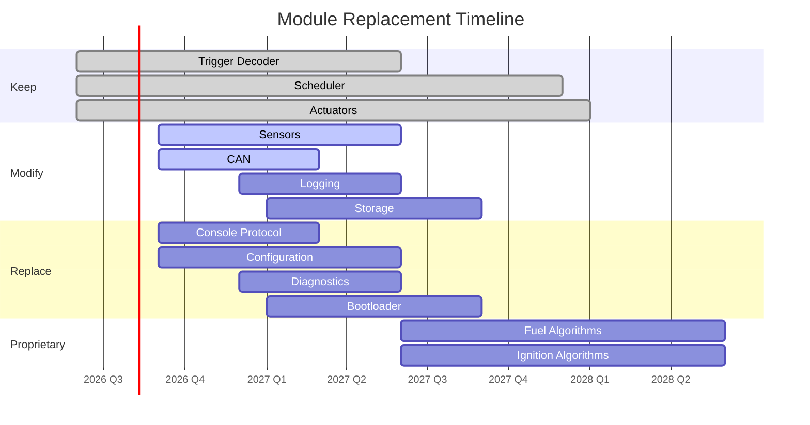

# Technical Debt

> **DDD Policy:** Every shortcut, TODO, workaround, and known issue must be recorded here immediately.
> Last updated: 2026-06-30

---

## Module Classification

Each module is classified by replacement difficulty and current strategy.

### Firmware Modules (rusEFI Foundation — upstream at commit `8540e44`)

| Module | Classification | Source Location | Rationale |
|--------|---------------|-----------------|-----------|
| Scheduler | KEEP | `firmware/controllers/system/timer/scheduler.h` | Stable template-based scheduler |
| Trigger Decoder | KEEP | `firmware/controllers/trigger/` (5 .cpp files) | Most mature rusEFI module |
| Outputs/Actuators | KEEP | `firmware/controllers/actuators/` (12 .cpp files) | Generic, widely tested |
| Watchdog | KEEP | ChibiOS HAL (IWDG) | Standard, reliable |
| Lua Scripting | KEEP | `firmware/controllers/lua/` | Key differentiator |
| Sensors | MODIFIABLE | `firmware/controllers/sensors/` (12 .cpp files) | May need custom sensors |
| CAN Bus | MODIFIABLE | `firmware/controllers/can/` (12 .cpp files) | Protocol needs adaptation |
| Knock Control | MODIFIABLE | `engine_cycle/knock_controller.cpp` + 28 board configs | May need custom algo |
| Logging | MODIFIABLE | `firmware/controllers/core/error_handling.cpp` | Needs structured format |
| Storage | MODIFIABLE | `firmware/controllers/algo/persistent_configuration.h` | Needs wear-leveling |
| Memory Layout | MODIFIABLE | Linker scripts | Needs A/B dual bank |
| Fuel Control | KEEP→REPLACE | `firmware/controllers/engine_cycle/fuel_schedule.*` | Replace in Phase 5 |
| Ignition Control | KEEP→REPLACE | `engine_cycle/spark_logic.*` + ignition_*.cpp | Replace in Phase 5 |
| Configuration | REPLACE | `firmware/controllers/algo/` (20 .cpp files) | Need cloud-synced config |
| Console Protocol | REPLACE | `firmware/console/` (7 .cpp files) | rusEFI-specific protocol |
| Bootloader | REPLACE | `firmware/bootloader/` (OpenBLT) | Need secure A/B + OTA |
| Diagnostics | REPLACE | `firmware/controllers/can/obd2.cpp` | Need custom UDS stack |

## Known Debt Items

| ID | Description | Impact | Priority | Module | Target |
|----|-------------|--------|----------|--------|--------|
| D-001 | GPL-3.0 license on firmware source limits commercial distribution | Legal: Critical | P0 | All firmware | Phase 5 |
| D-002 | Console protocol is rusEFI-specific — must be replaced before Studio v1 | Integration: High | P1 | Console | Phase 2 |
| D-003 | Bootloader uses OpenBLT (no secure boot, no A/B) | Safety: High | P1 | Bootloader | Phase 3 |
| D-004 | No secure boot chain | Security: High | P1 | Bootloader | Phase 3 |
| D-005 | Configuration format is rusEFI-specific — not cloud-compatible | Interop: Medium | P2 | Configuration | Phase 2 |
| D-006 | No OTA update mechanism | Features: Medium | P2 | Bootloader | Phase 3 |
| D-007 | Scheduler is not preemptive RTOS | Determinism: Low | P3 | Scheduler | Phase 5 |
| D-008 | Shallow clone — no full upstream history for tracking changes | Maintenance: Low | P3 | Repository | Phase 1 |
| D-009 | Build toolchain partially installed — ARM GCC 10.3.1 OK, Java missing (required for rusEFI code generation) | Operational: Medium | P1 | Build | Phase 1 |
| D-010 | rusEFI branding strings not yet traced in source | Brand: Medium | P2 | Branding | Phase 1 |
| D-011 | No module-level documentation (fuel.md, ignition.md, etc.) | Documentation: Medium | P2 | Docs | Phase 1 |
| D-012 | No diagrams (architecture, boot flow, memory map, etc.) | Documentation: Medium | P2 | Docs | Phase 2 |

## Debt Priority Legend

| Priority | Definition | Response |
|----------|------------|----------|
| P0 | Blocking — must fix immediately | Stop all other work |
| P1 | Critical — blocks Phase 2 | Fix before next phase |
| P2 | Important — should fix in current phase | Schedule within phase |
| P3 | Nice to have — no immediate blocker | Schedule when convenient |

## Replacement Roadmap

> **Note:** Mermaid rendering may not display in all markdown viewers. See text timeline below.

### Text Timeline

- **Phase 2 (2026 Q3-Q4):** Replace Console Protocol, modify Configuration
- **Phase 3 (2027 Q1-Q2):** Replace Bootloader, Diagnostics; modify CAN, Sensors
- **Phase 4 (2027 Q2-Q4):** Modify Logging, Storage; hardware production
- **Phase 5 (2028):** Replace Fuel, Ignition algorithms with proprietary implementations
